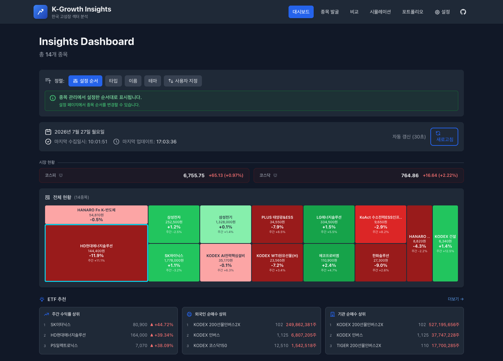
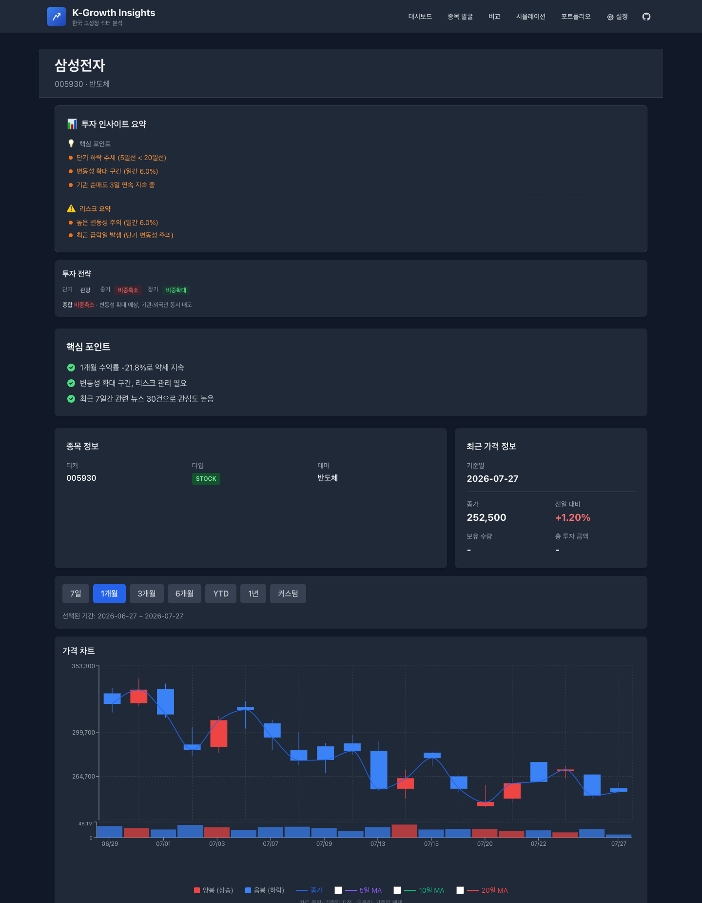
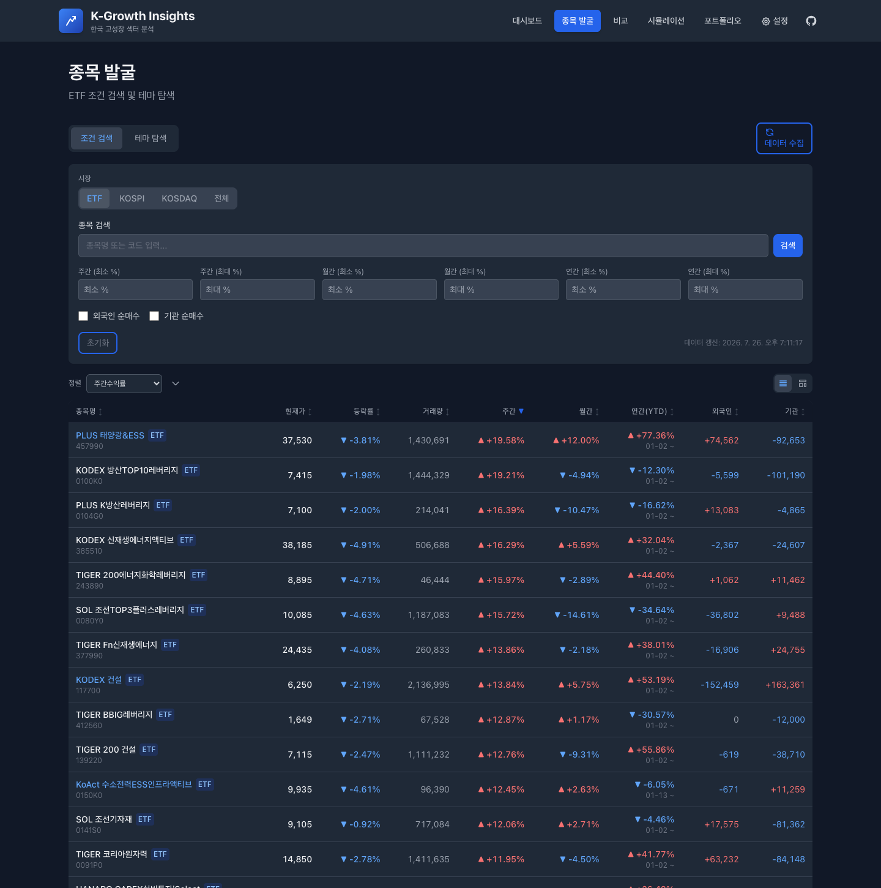

# K-Growth Insights

한국 고성장 섹터 **ETF·주식** 분석 애플리케이션. 웹으로 쓰거나 macOS 데스크톱 앱으로 실행합니다.
모든 시장 데이터를 **네이버 모바일 API**(JSON)에서 수집합니다.

[소개 사이트](https://kangsuek.github.io/K-Growth-Insights/) · [최신 릴리스 내려받기](https://github.com/kangsuek/K-Growth-Insights/releases/latest)



수집한 데이터는 **로컬 SQLite 파일 하나**에만 저장됩니다. 외부로 전송하는 서버가 없고 계정 가입도 없습니다.

## 데이터 출처 (수집 계층)

| 데이터 | 엔드포인트 |
|---|---|
| 일별 시세(OHLCV) | `m.stock.naver.com/api/stock/{code}/price` |
| 매매동향(외국인/기관/개인) | `m.stock.naver.com/api/stock/{code}/trend?trendType=1` |
| 분봉(분당 체결) | `api.stock.naver.com/chart/domestic/item/{code}/minute` |
| 종목명·유형(STOCK/ETF) | `m.stock.naver.com/api/stock/{code}/basic` |
| 펀더멘털(PER/PBR/NAV) | `m.stock.naver.com/api/stock/{code}/integration` |
| ETF 구성종목 | `m.stock.naver.com/api/stock/{code}/etfAnalysis` |
| 시총 상위 카탈로그 | `m.stock.naver.com/api/stocks/marketValue/{market}` |
| 뉴스 | `openapi.naver.com/v1/search/news.json` (API 키 필요) |

뉴스만 네이버 검색 API 키가 필요합니다. 설정 화면에서 등록하며, 없어도 나머지 기능은 모두 동작합니다.

## 화면

| 경로 | 화면 | 내용 |
|---|---|---|
| `/` | 대시보드 | 시장 현황(코스피·코스닥), 보유/관찰 종목 히트맵, 추천 카드 |
| `/etf/:ticker` | 종목 상세 | 인사이트 요약, 투자 전략, 일별 캔들+거래량, 매매동향, RSI/MACD, 분봉, 뉴스, 펀더멘털 |
| `/scanner` | 종목 발굴 | 카탈로그 전체 대상 조건 검색(수익률·순매수·섹터), 테마 탐색, 추천 프리셋 |
| `/compare` | 비교 | 정규화 가격 추이, 위험-수익 산점도, 상관관계 히트맵, 성과 비교, 투자 시뮬레이션 |
| `/simulation` | 시뮬레이션 | 일시 투자·적립식(DCA)·포트폴리오 배분 — "그때 샀다면?" |
| `/portfolio` | 포트폴리오 | 투자금·평가액·손익, 비중, 수익률 추이, 종목별 기여도, 분석 리포트 |
| `/settings` | 설정 | 종목 관리(추가·수정·삭제·순서), API 키, 데이터 수집·초기화, 테마 |





## 아키텍처

```
FastAPI backend (backend/app)  ──/api──▶  React + Vite frontend (frontend/src)
        │                                          │
        ├─ routers/    etfs · data · scanner · settings · simulation · news · market
        ├─ services/
        │    ├─ naver_client.py   네이버 모바일 API 클라이언트(정규화)
        │    ├─ collectors.py     fetch → SQLite upsert
        │    ├─ repository.py     읽기 쿼리
        │    ├─ metrics.py        화면 공통 지표(주간수익률·연환산 변동성)
        │    ├─ scanner.py        카탈로그 검색·테마·추천
        │    ├─ comparison.py     정규화·통계·상관관계
        │    ├─ simulation.py     일시·적립식·포트폴리오
        │    ├─ insights.py       전략·핵심 포인트·리스크
        │    ├─ catalog.py        시총 상위 카탈로그 + 섹터 분류
        │    └─ scheduler.py      장중 주기 수집 + 마감 후 수집
        └─ data/kgrowth.db        SQLite (단일 파일)
```

- 백엔드: **uv** + FastAPI + **SQLite 전용**
- 프론트엔드: **npm** + React + Vite + recharts + TanStack Query
- 데스크톱: Electron (`desktop/`) — Electron 셸이 백엔드를 띄우고 빌드된 프론트를 로드

**지표 계산은 백엔드 `metrics.py`에 모읍니다.** 같은 이름의 지표가 화면마다 다른 값을 내지 않도록
주간 수익률·연환산 변동성(표본표준편차 기준)을 한 곳에서 계산합니다.

표시 숫자는 항상 천 단위 구분 기호를 사용합니다.

## 빠른 시작

```bash
just setup      # 백엔드(uv) + 프론트엔드(npm) 의존성 설치, .env 생성
just db         # SQLite 초기화

# 터미널 2개
just backend    # :8000
just frontend   # :5173

just collect    # 전체 데이터 수집(네이버 모바일 API)
```

브라우저에서 http://localhost:5173 접속.

| 명령 | 설명 |
|---|---|
| `just setup` | 의존성 설치 + `.env` 생성 |
| `just db` | SQLite 스키마 초기화 |
| `just backend` | FastAPI 개발 서버 (:8000) |
| `just frontend` | Vite 개발 서버 (:5173) |
| `just collect` | 전체 종목 시세·매매동향 수집 |
| `just test` | pytest + vitest |
| `just build` | 프론트엔드 프로덕션 빌드 |

## API

엔드포인트 41개. 시세·매매동향은 **항상 최신순(DESC)**, 분봉·지수 차트는 **시간순(ASC)** 으로 반환합니다.

| 메서드 | 경로 | 설명 |
|---|---|---|
| GET | `/api/etfs/` | 추적 종목 목록(구매 정보 포함) |
| GET | `/api/etfs/{ticker}` | 종목 상세 |
| GET | `/api/etfs/{ticker}/prices` | 일별 시세 (최신순) |
| GET | `/api/etfs/{ticker}/trading-flow` | 투자자별 매매동향 (최신순) |
| GET | `/api/etfs/{ticker}/intraday` | 최근 세션 분봉 (시간순) |
| GET | `/api/etfs/{ticker}/fundamentals` | 펀더멘털(주식 PER/PBR, ETF NAV·구성종목) |
| GET | `/api/etfs/{ticker}/insights` | 전략·핵심 포인트·리스크 |
| GET | `/api/etfs/compare?tickers=A,B` | 정규화 가격·통계·상관관계 |
| POST | `/api/etfs/batch-summary` | 여러 종목 요약 일괄 조회 |
| GET | `/api/scanner` | 조건 검색(수익률·순매수·섹터·정렬·페이지) |
| GET | `/api/scanner/themes` | 섹터별 그룹 |
| GET | `/api/scanner/recommendations` | 추천 프리셋 |
| POST | `/api/simulation/lump-sum` | 일시 투자 |
| POST | `/api/simulation/dca` | 적립식(DCA) |
| POST | `/api/simulation/portfolio` | 포트폴리오 배분 |
| GET/POST/PUT/DELETE | `/api/settings/stocks[/{ticker}]` | 종목 관리 |
| POST | `/api/settings/ticker-catalog/collect` | 시총 상위 카탈로그 수집 |
| GET | `/api/news/{ticker}` | 종목 뉴스 |
| GET | `/api/market/overview` | 코스피·코스닥 현황 |
| POST | `/api/data/collect-all` | 전체 수집 |
| GET | `/api/data/stats` | 수집 통계 |
| DELETE | `/api/data/reset` | 수집 데이터 초기화(종목 목록 유지) |

전체 목록은 서버 기동 후 http://localhost:8000/docs 에서 확인할 수 있습니다.

## 추적 종목 관리

추적 종목의 소스는 **DB(`stocks` 테이블)** 이며, 설정 화면에서 추가·수정·삭제·순서 변경을 합니다.

`backend/config/stocks.json`은 **최초 1회 시딩용**입니다. `stocks` 테이블이 비어 있을 때만 읽습니다.
앱이 뜰 때마다 동기화하면 화면에서 삭제한 종목이 되살아나기 때문입니다.

## 데스크톱 앱 (macOS)

### 설치해서 쓰기

1. **`uv`를 먼저 설치합니다.** dmg에는 파이썬 환경이 들어있지 않고, 앱이 처음 실행될 때 `uv`로
   백엔드 가상환경을 만듭니다.
   ```bash
   curl -LsSf https://astral.sh/uv/install.sh | sh
   ```
2. [최신 릴리스](https://github.com/kangsuek/K-Growth-Insights/releases/latest)에서 dmg를 받습니다 —
   Apple Silicon은 `-arm64.dmg`, Intel Mac은 접미사 없는 `.dmg`.
3. 서명·공증되지 않은 빌드라면 처음 열 때 Gatekeeper 경고가 뜹니다. 시스템 설정 →
   개인정보 보호 및 보안에서 "확인 없이 열기"를 누르면 실행됩니다. 서명 여부는 각 릴리스 노트에 표시됩니다.

### 직접 빌드하기

```bash
just build                 # 프론트엔드 빌드 (필수 — dmg에 포함된다)
cd desktop
npm run build              # dmg 생성 (arm64 + x64)
npm run build:dir          # 패키징만 확인 (dmg 없음, 가장 빠름)
npm run build:release      # 서명 + 공증 (배포용, 자격증명 필요)
```

산출물은 `desktop/release/`에 생성됩니다.

서명·공증 준비물과 검증 방법은 [docs/desktop-release.md](./docs/desktop-release.md) 참고.
인증서가 없으면 `npm run build`는 서명을 건너뛰고 계속 진행합니다(로컬 확인용으로는 문제없음).

> Electron 셸은 실행 시 `uv`를 찾아 사용자 워크스페이스에 가상환경을 만들고 백엔드를 띄운 뒤
> 빌드된 프론트엔드를 로드합니다. 그래서 **설치 대상 기기에 `uv`가 필요**합니다.

## 배포 (GitHub)

| 워크플로 | 트리거 | 하는 일 |
|---|---|---|
| `.github/workflows/release.yml` | `v*` 태그 push | macOS dmg(arm64·x64) 빌드 → GitHub Release 업로드 |
| `.github/workflows/pages.yml` | `site/**` 변경 | `site/`의 소개 페이지를 GitHub Pages로 배포 |

```bash
git tag v1.0.0 && git push origin v1.0.0   # 릴리스 생성
```

릴리스 워크플로는 `CSC_LINK` 시크릿이 있으면 서명·공증까지 하고, 없으면 미서명으로 빌드합니다.
서명 시 필요한 시크릿은 `CSC_LINK`, `CSC_KEY_PASSWORD`, `APPLE_ID`, `APPLE_APP_SPECIFIC_PASSWORD`,
`APPLE_TEAM_ID` — 발급 방법은 [docs/desktop-release.md](./docs/desktop-release.md)에 있습니다.

Pages는 저장소 Settings → Pages → Source를 **GitHub Actions**로 한 번 바꿔야 동작합니다.

## 테스트

```bash
just test        # 전체
uv run --directory backend pytest      # 백엔드 161건
npm --prefix frontend test -- --run    # 프론트엔드 350건
```

백엔드 검증은 pytest로만 합니다. `uv run python -c "..."` 같은 raw 스크립트는 `DATABASE_PATH`가
실제 `backend/data/kgrowth.db`를 가리켜 실 데이터를 덮어씁니다(격리 픽스처는 pytest 안에서만 적용).

## 개발 규칙

기여 시 지켜야 할 규칙은 [CLAUDE.md](./CLAUDE.md)에 정리돼 있습니다. 요약:

- 주석·커밋 메시지 설명은 한글로 작성 (conventional-commits 접두사는 영어 유지)
- 사용자에게 보이는 숫자는 천 단위 구분 기호
- 데이터 수집은 반드시 `services/naver_client.py`를 통해
- 실제 호출되는 엔드포인트만 유지 — 미사용 라우트·래퍼를 만들지 않음

## 라이선스

MIT License.

## 면책

본 프로그램이 제공하는 모든 수치와 분석은 **투자 참고용**이며 투자 권유가 아닙니다.
데이터는 네이버 모바일 API에서 수집한 것으로 정확성·완전성을 보장하지 않습니다.
투자 판단과 그 결과에 대한 책임은 이용자 본인에게 있습니다.
